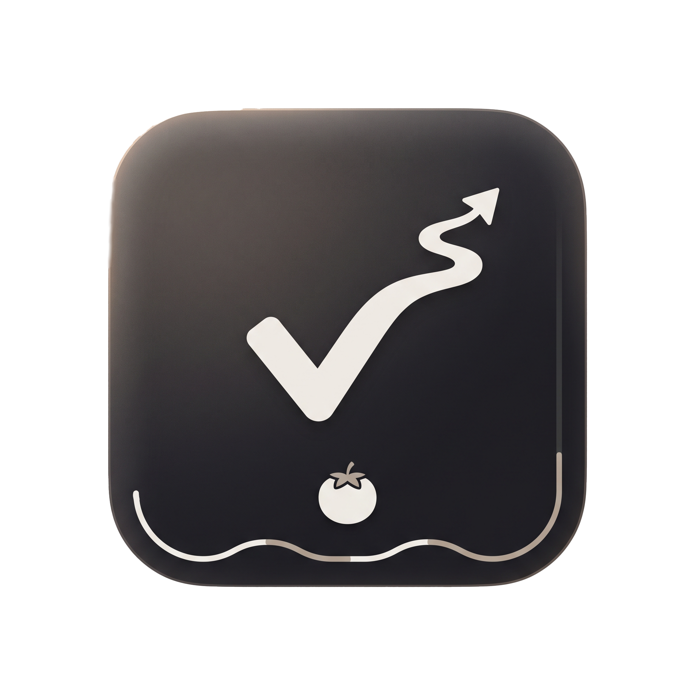

<div align="center">



# ⚔️ QuestDesk
### 桌面端个人成长与学习 RPG 悬浮工作台
### Desktop RPG Floating Task Terminal for Lifelong Learners

**OKR 定方向 ｜ Quest 定行动 ｜ 结果定沉淀**  
**Direction via OKR ｜ Action via Quest ｜ Growth via Results**

[English](#-english) • [简体中文](#-简体中文)

[](https://www.python.org/)
[-41CD52?style=flat-square&logo=qt&logoColor=white)](https://doc.qt.io/qtforpython/)
[](LICENSE)
[](https://github.com/kareOMG/QuestDesk/releases/tag/v1.0.0)
[](#)

</div>

---

<a name="-english"></a>
## 🇬🇧 English

### 📖 Overview

**QuestDesk** is a lightweight, immersive desktop RPG floating task terminal designed for lifelong learners, students, and software engineers. 

Traditional to-do tools often impose rigid pressure. QuestDesk embraces a **"Natural Fluctuation + Key Result Compounding"** philosophy:
- **No Rigid Pressure**: Weekly rhythms (Foundations, Deep Work, Review) that adapt to natural study fluctuations.
- **Pomodoro as Investable Resources**: Pomodoros are dynamic energy units you invest into main campaign quests or free exploration.
- **Gamified Progression**: Every subtask checked off and every focus session completed feeds directly into character EXP, 5-dimensional attributes, rank titles, and achievement badges.
- **Immersive Micro-interactions**: Native procedural acoustic chimes, a 60fps celebratory particle fireworks explosion upon clearing all daily tasks, and hidden easter egg interactions.

---

### ✨ Key Features

1. **🎮 Immersive RPG Character & Skill Trees**
   - **Rank Title Progression**: Climb from `Lv.1 Novice Pathfinder` and `Apprentice` to `Senior Scholar`, `Astral Explorer`, and `Mythic Architect`.
   - **5-Dimensional Intellectual Attributes**:
     - 📐 **Math** (Logical reasoning, formula derivation)
     - 💻 **Coding** (Algorithms, data structures, low-level engineering)
     - 📖 **English** (Vocabulary, syntax parsing, reading comprehension)
     - 🛠️ **Practice** (Engineering projects, hands-on development)
     - 🏛️ **Mind** (Weekly review, metacognition, self-discipline)
   - **Daily Epic Quest Wrapping**: Ordinary to-dos are dynamically themed into epic RPG trials (e.g. *"Wisdom Trial: Logical Breakthrough"*).

2. **📅 Smart OKR Weekly Schedule**
   - **Monday–Sunday Thematic Rhythm**: Balance study loads with tailored daily themes.
   - **Capsule Quest Cards**: Major quest modules with subtask checklists showing real-time progress (`done/total`) and pomodoro budgets.
   - **Weekly Review & One-Click Settlement**: Sunday review mode rolls over progress, clears daily checkmarks for the upcoming week, while preserving lifetime EXP and unlocked badges.

3. **🍅 Dual-Track Focus System**
   - **Campaign Quests**: Tied directly to designated subtasks to boost corresponding attribute points.
   - **Free Exploration Mode**: Launch spontaneous focus sessions anytime to record impromptu learning, still earning valuable EXP.

4. **🏆 20 Badges & Secret Easter Eggs**
   - **7 Diverse Categories**: Start, Growth, Focus, Academia, Campaign, Resilience, and Easter Eggs.
   - **Mysterious Hidden Mechanisms**:
     - 🐾 **Curiosity Killed the Cat**: Tap the top-left Logo badge 10 times to unlock a secret mechanism!
     - 🦉 **Night Stalker**: Conquering tasks late into the quiet night after 23:00.
     - 🌅 **Dawn Vanguard**: Seizing the first light of dawn before 07:00.
     - ⚔️ **Weekend Berserker**: Relentless determination on weekends.
     - Unlocked easter eggs show as `❓ ??? (Hidden Quest)` accompanied by poetic clues.

5. **🎵 Native Pure Audio & 60fps Confetti**
   - **Zero-Dependency Native Sound Engine**: Procedural high-fidelity chimes for task completions, level-ups, and daily clears (`winsound` on Windows, native `afplay` on macOS).
   - **Daily Cleared Celebration**: Completing all daily quests triggers a lively 60fps confetti fireworks cannon animation.

6. **🪟 Charcoal Frosted Glass Aesthetic**
   - **Warm Charcoal Palette**: High-contrast, glare-free dark translucent glass styling.
   - **8-Directional Border Resizing**: Effortlessly drag any edge or corner to resize with minimum safe dimensions.
   - **Stepless Opacity Slider**: Adjust transparency from 35% to 100%.
   - **Desktop Integration**: Edge snapping, minimize-to-tray, and always-on-top toggle.

---

### 🗂️ Project Structure

```text
QuestDesk/
├── assets/                  # Media assets (Logo, task icons, procedural WAV audio)
├── config/                  # Global constants, attributes, and 20 achievement templates
├── core/                    # Core path derivation, data isolation, and runtime DLL patches
├── data/                    # User data storage (okr_data.json) and rolling backups
├── events/                  # Decoupled publish-subscribe event bus
├── models/                  # Domain entities (BigTask, SmallTask, UserStats, Achievement)
├── services/                # Business services (XP, Achievement, Audio, Backup, Task)
├── storage/                 # Atomic JSON persistence interface
├── ui/                      # PySide6 modern frameless UI components & animations
├── QuestDesk.spec           # PyInstaller clean packaging specification
├── build_windows.bat        # Windows one-click executable builder
├── main.py                  # Declarative application entry point
└── requirements.txt         # Minimal runtime dependencies
```

---

### 🚀 Quick Start (English)

#### Requirements
- Python 3.10+
- Windows 10/11, macOS, or modern Linux distribution

#### 1. Clone the repository
```bash
git clone https://github.com/kareOMG/QuestDesk.git
cd QuestDesk
```

#### 2. Create and activate a virtual environment
```bash
# Windows
python -m venv venv
.\venv\Scripts\activate

# macOS / Linux
python3 -m venv venv
source venv/bin/activate
```

#### 3. Install dependencies
```bash
pip install -r requirements.txt
```

#### 4. Run the application
```bash
python main.py
```

#### 5. Windows Standalone Executable
You can download the pre-packaged green release directly from [GitHub Releases](https://github.com/kareOMG/QuestDesk/releases/tag/v1.0.0), or compile it yourself:
```cmd
build_windows.bat
```
The portable executable will be generated at `dist/QuestDesk/QuestDesk.exe`.

---

<a name="-简体中文"></a>
## 🇨🇳 简体中文

### 📖 简介

**QuestDesk** 是一款专为终身学习者、考研攻坚党及程序员打造的**轻量化桌面 RPG 悬浮学习终端**。

传统打卡软件往往充斥着冰冷的 KPI 压力，而 QuestDesk 采用**「自然浮动 + 关键结果补偿」**哲学：
- **拒绝死板的强制打卡**：以周为单位进行节奏编排（专业课启动、数学攻坚、深度工作等），允许日常学习时间自然浮动。
- **资源化番茄投入**：番茄钟不再只是倒计时工具，而是你可以自由投资到“主线任务攻坚”或“未知自由探索”中的成长资源。
- **全要素游戏化反馈**：每次小任务攻关、每段番茄专注，都会化作角色经验（EXP）、五维能力属性点与成就徽章，让长期的复习积累可视化、可感知。
- **沉浸视听与微交互**：轻柔温润的纯净采样提示音、单日任务全清 60fps 烟花纸屑粒子庆祝，以及主界面徽记敲击彩蛋。

---

### ✨ 核心特性

1. **🎮 沉浸式 RPG 角色与能力成长**
   - **阶梯称号体系**：从 `Lv.1 初级探路者`、`进阶学徒`，一路突破至 `星旅探索者`、`传奇造物主`。
   - **五维学识属性**：📐 数学、💻 编程、📖 英语、🛠️ 实践、🏛️ 心智。
   - **每日冒险事件包装**：自动将普通的复习打卡转化为沉浸式史诗冒险。

2. **📅 智能 OKR 周度排期管理**
   - **周一至周日节奏编排**：依据脑力负荷定制专属主线科目。
   - **胶囊排期卡片**：大任务模块搭配精炼清单，呈现完成进度与番茄预算。
   - **周度复盘与一键重置**：支持「一键结转沉淀」，开启新一周，累积专注度与历史成就永久保留。

3. **🍅 双轨专注投入系统**
   - **主线攻坚番茄**：与具体小任务绑定，完成后直接计入对应科目沉淀。
   - **自由探索模式**：支持开启轻量化自由专注，记录临时自习与发散研究。

4. **🏆 20 大成就勋章墙与神秘隐藏彩蛋**
   - **7 大分类成就体系**：起步、成长、专注、学术、战役、坚韧与彩蛋。
   - **隐秘彩蛋机制**：轻叩主界面 Logo 10 次解锁「🐾 好奇心害死猫」、深宵「🦉 夜巡游侠」、晨曦「🌅 晨曦先驱」、周末「⚔️ 周末狂战士」。

5. **🎵 轻柔音频与 60fps 庆典粒子**
   - **跨平台原生零依赖音频引擎**：任务完成轻柔和弦、升级音效、凯旋全清提示音（Windows 使用 `winsound`，macOS 调度原生 `afplay`）。
   - **今日试炼全清庆祝**：完成当天所有预定任务即刻触发 60fps 物理粒子礼花彩带喷洒动效。

6. **🪟 暖炭磨砂玻璃泛美学**
   - 全局杜绝刺眼纯白，柔和护眼。
   - 支持窗口四周及四角八向自由拖拽拉伸。
   - 35% ~ 100% 无级透明度调节与系统托盘常驻。

---

### 🛠️ 快捷交互说明 / Shortcuts

| 交互动作 / Action | 作用说明 / Description |
| :--- | :--- |
| **拖拽窗口顶部 / Drag Window Header** | 自由移动桌面悬浮窗 / Move floating window freely |
| **拖拽窗口边缘或四角 / Drag Borders & Corners** | 实时拉伸调整长宽尺寸 / Resize window smoothly in 8 directions |
| **轻叩主界面 Logo / Tap Header Logo** | 触发微弹跳动画，点击 10 次探索彩蛋 / Trigger micro-bounce, tap 10x for easter egg |
| **点击任务圆圈 / Click Task Checkbox** | 标记攻克完成并结算经验音效 / Mark task done with chime feedback & XP settlement |
| **周度复盘与一键重置 / Weekly Reset** | 每周结算并清空勾选状态 / Rollover progress and reset checklist for the new week |
| **设置 -> 外观 / Settings -> Opacity** | 无级调节面板背景不透明度 (35% ~ 100%) / Adjust background glass opacity seamlessly |

---

### 🙏 致谢 / Acknowledgements

- **Game Icon Assets**: 本项目中采用的游戏化高保真矢量与像素图标取材自开源项目 [Nieobie/Game-Icon-Pack](https://github.com/Nieobie/Game-Icon-Pack)，特此对原作者致以诚挚感谢！

---

### 🛡️ 开源协议 / License

本项目采用 [MIT 许可证](LICENSE) 进行开源。欢迎提交 Issue 或 Pull Request！  
This project is open-sourced under the [MIT License](LICENSE).